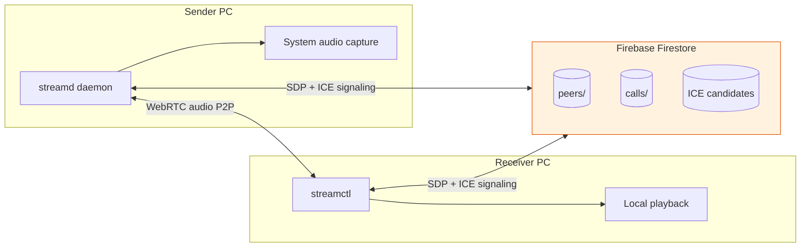

# streamd

Peer-to-peer system audio streaming over WebRTC, with Firebase Firestore used only for signaling (SDP and ICE exchange). Audio never passes through Firebase.

Two CLI applications:

| Binary | Role |
|--------|------|
| `streamd` | Sender daemon — captures system speaker output and streams to receivers |
| `streamctl` | Receiver CLI — connects to a sender and plays audio locally |

## Architecture



**Connection flow**

1. Sender runs `streamd start` and registers in `peers/{peerID}`.
2. Receiver runs `streamctl connect office-pc`.
3. Receiver creates a document in `calls/{callID}` with `status: pending`.
4. Sender sees the pending call, creates a WebRTC offer, and writes it to Firestore.
5. Receiver reads the offer, creates an answer, and writes it back.
6. Both sides exchange ICE candidates via subcollections.
7. WebRTC connects peer-to-peer; Opus-encoded audio flows directly between machines.

## Project structure

```
cmd/
  streamd/          Sender daemon entrypoint
  streamctl/        Receiver CLI entrypoint
internal/
  signaling/        Firestore signaling client
  webrtc/           WebRTC peer connection logic
  audio/            System capture and playback
  codec/            Opus encode/decode
  config/           YAML configuration
  daemon/           Daemon lifecycle and logging
  receiver/         Receiver connection client
configs/            Example config, Firestore rules
```

## Prerequisites

- Go 1.22+
- **libopus** (required for CGO Opus codec)
- **pkg-config**
- Firebase project with Firestore enabled
- Firebase service account JSON key

### Install libopus

**Ubuntu / Debian**

```bash
sudo apt update
sudo apt install libopus-dev pkg-config
```

**Fedora**

```bash
sudo dnf install opus-devel pkgconfig
```

**macOS**

```bash
brew install opus pkg-config
```

**Windows (MSYS2 / MinGW cross-compile)**

```bash
pacman -S mingw-w64-x86_64-opus pkg-config
```

Verify:

```bash
pkg-config --exists opus && echo "OK"
```

### Linux audio (sender)

Uses PulseAudio loopback via `parec` (captures default sink monitor — speaker output, not mic):

```bash
sudo apt install pulseaudio-utils   # provides parec and pactl
```

### Windows audio (sender)

Uses WASAPI loopback capture via [malgo](https://github.com/gen2brain/malgo). No extra driver needed; capture what is playing through the default output device.

### macOS audio (sender)

macOS does not expose speaker loopback like Windows. Use a virtual audio device:

1. Install [BlackHole](https://existential.audio/blackhole/) (free)
2. Open **Audio MIDI Setup** → create **Multi-Output Device** with your speakers + BlackHole 2ch
3. Set that Multi-Output Device as the system output in **Sound Settings**
4. `streamd` captures from BlackHole automatically (or set `audio.capture_device` in config)

Example sender config: `configs/config.macos.example.yaml`

Build on the MacBook (Apple Silicon):

```bash
brew install opus pkg-config
make build-darwin-arm64
./bin/streamd-darwin-arm64 start --foreground
```

**Mac sender + Linux receiver** is supported: build `streamd` on Mac, `streamctl` on Linux, same Firebase project and service account on both.

## Firebase setup

### 1. Create a Firebase project

This repo is already linked to **`streamd-p2p-signaling`** via `.firebaserc`.

Console: https://console.firebase.google.com/project/streamd-p2p-signaling/overview

To re-link or use another project:

```bash
firebase use --add
```

### 2. Service account key

1. Project Settings → Service accounts → **Generate new private key**.
2. Save the JSON file as `~/.streamd/service-account.json`.

### 3. Deploy Firestore rules and indexes

Already deployed for `streamd-p2p-signaling`. To redeploy after edits:

```bash
firebase deploy --only firestore:rules,firestore:indexes
```

Rules and indexes live in `configs/firestore.rules` and `configs/firestore.indexes.json`.

**MVP rules allow open read/write** (no authentication). Restrict before any production use.

### 4. Firestore data model

```
peers/{peerID}
  online: bool
  lastSeen: timestamp

calls/{callID}
  senderID: string
  receiverID: string
  offer: string
  answer: string
  status: string        # pending | offer_sent | answer_sent | connected | failed | closed
  createdAt: timestamp

calls/{callID}/senderCandidates/{id}
  candidate: string
  sdpMid: string
  sdpMLineIndex: number

calls/{callID}/receiverCandidates/{id}
  candidate: string
  sdpMid: string
  sdpMLineIndex: number
```

## Configuration

Copy the example config and edit for each machine:

```bash
mkdir -p ~/.streamd
cp configs/config.example.yaml ~/.streamd/config.yaml
# project_id is already set to streamd-p2p-signaling in the example
```

Download a service account key from:
https://console.firebase.google.com/project/streamd-p2p-signaling/settings/serviceaccounts/adminsdk

Save it as `~/.streamd/service-account.json`.

Or run:

```bash
./scripts/firebase-local-setup.sh
```

**Sender (`office-pc`)** — `~/.streamd/config.yaml`:

```yaml
peer_id: office-pc

firebase:
  project_id: your-firebase-project-id
  credentials_file: ~/.streamd/service-account.json

audio:
  sample_rate: 48000
  channels: 1
  frame_ms: 20

webrtc:
  stun_servers:
    - stun:stun.l.google.com:19302

log_level: info
```

**Receiver** — use a different `peer_id` (e.g. `living-room-pc`) on the listening machine; same Firebase project.

## Build

```bash
make deps
make build
```

Or manually:

```bash
CGO_ENABLED=1 go build -o bin/streamd ./cmd/streamd
CGO_ENABLED=1 go build -o bin/streamctl ./cmd/streamctl
```

Cross-compile for Windows from Linux (requires MinGW + libopus):

```bash
make build-windows
```

## Running

### Sender (machine whose audio you want to stream)

```bash
./bin/streamd start          # background daemon
./bin/streamd start --foreground   # foreground (debugging)
./bin/streamd status
./bin/streamd stop
```

Expected log output:

```
[INFO] Stream daemon started
[INFO] Firebase connected
[INFO] Peer ID: office-pc
[INFO] Waiting for connections
[INFO] Incoming connection
[INFO] WebRTC connected
[INFO] Streaming audio
```

### Receiver (machine that plays the audio)

```bash
./bin/streamctl list
./bin/streamctl connect office-pc
```

Press `Ctrl+C` to disconnect.

## Audio format

| Parameter | Value |
|-----------|-------|
| Codec | Opus (VoIP profile) |
| Sample rate | 48 kHz |
| Channels | Mono |
| Frame size | 20 ms |
| Bitrate | 64 kbps |

WebRTC track type: `TrackLocalStaticSample` with Opus payloads.

## Networking

- STUN: `stun:stun.l.google.com:19302` (default)
- TURN: not implemented in MVP; architecture supports adding TURN servers to `webrtc.stun_servers` / future `turn_servers` config later.

If peers are on different NATs and connection fails, you will need TURN (future work).

## Windows audio permissions

- Run `streamd` as the logged-in user (same session as the audio playing).
- WASAPI loopback captures the default playback device; set the correct default output in Sound settings.
- Some virtual audio drivers may not support loopback — use physical or standard Windows audio devices for testing.

## Troubleshooting

| Problem | Things to check |
|---------|-----------------|
| `libopus not found` on build | Install `libopus-dev` / `opus-devel`; verify with `pkg-config --exists opus` |
| `Firebase connected` fails | Service account path, project ID, Firestore enabled, network |
| Peer not in `streamctl list` | Sender running? `streamd status`? Firestore rules? |
| WebRTC connection timeout | Firewall UDP; try same LAN first; NAT may need TURN later |
| No audio on Linux sender | PulseAudio running? `pactl get-default-sink`; install `pulseaudio-utils` |
| No audio on receiver | Volume/mute; WebRTC state `connected`; check logs with `log_level: debug` |
| `streamd is already running` | `streamd stop` or remove stale `~/.streamd/streamd.pid` |

### Debug logging

Set in `~/.streamd/config.yaml`:

```yaml
log_level: debug
```

Sender logs also append to `~/.streamd/streamd.log` when running as a daemon.

## Security (MVP)

- No user authentication
- Firestore rules are open (signaling only)
- WebRTC encrypts media with DTLS/SRTP

Code is structured so authentication (Firebase Auth tokens, peer allowlists) can be added in `internal/signaling` and Firestore rules without changing the WebRTC path.

## License

MIT (or your project license)
# streamd
